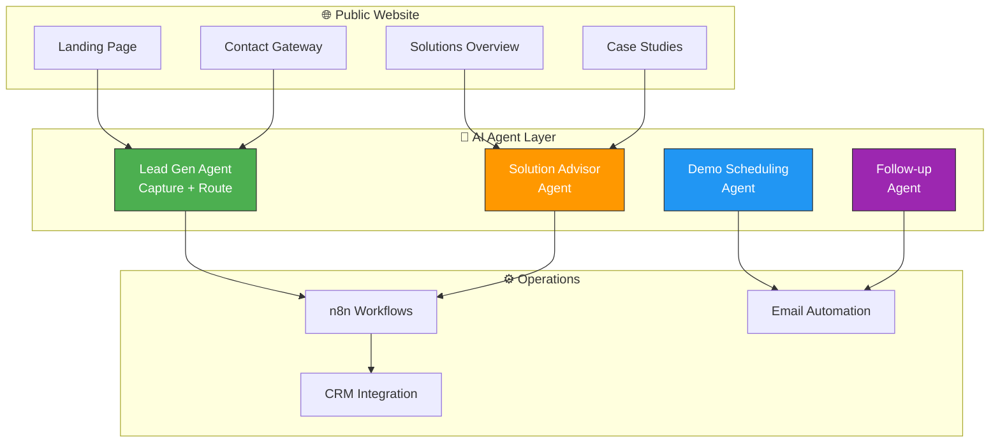
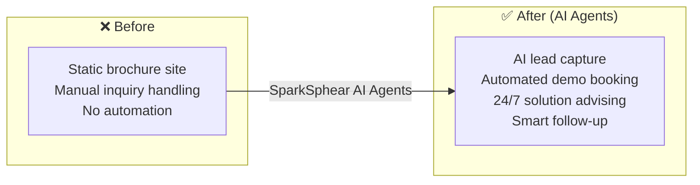

# 🌐 SparkSpheartechSolutions.com — AI-Powered Business Website Agent

> **The public-facing AI agent hub for SparkSphear Tech Solutions**  
> Where businesses discover AI-powered automation solutions.

---

## 🧠 AI Agent Architecture

## 🔄 Before vs After

---

Built by **[Shazaly Musa](https://github.com/SparkSpheartech)** — Founder, SparkSphear Tech  
*AI Agents for Business Growth & Automation*